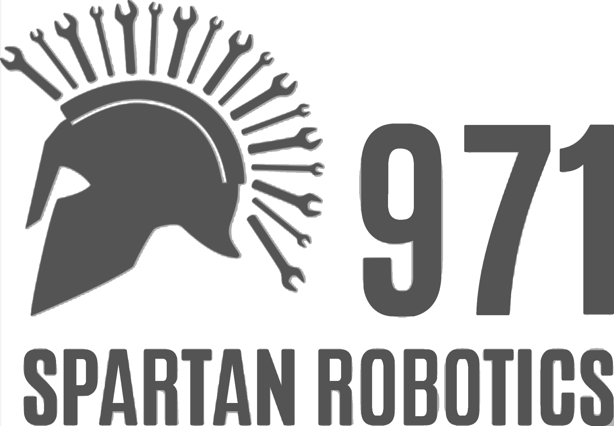
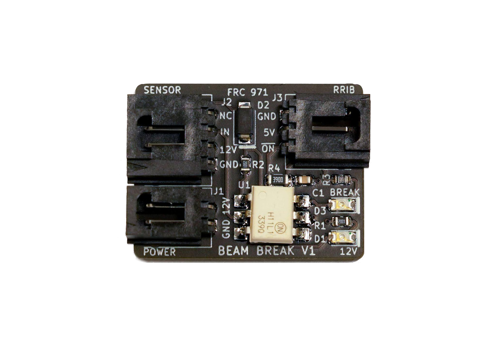
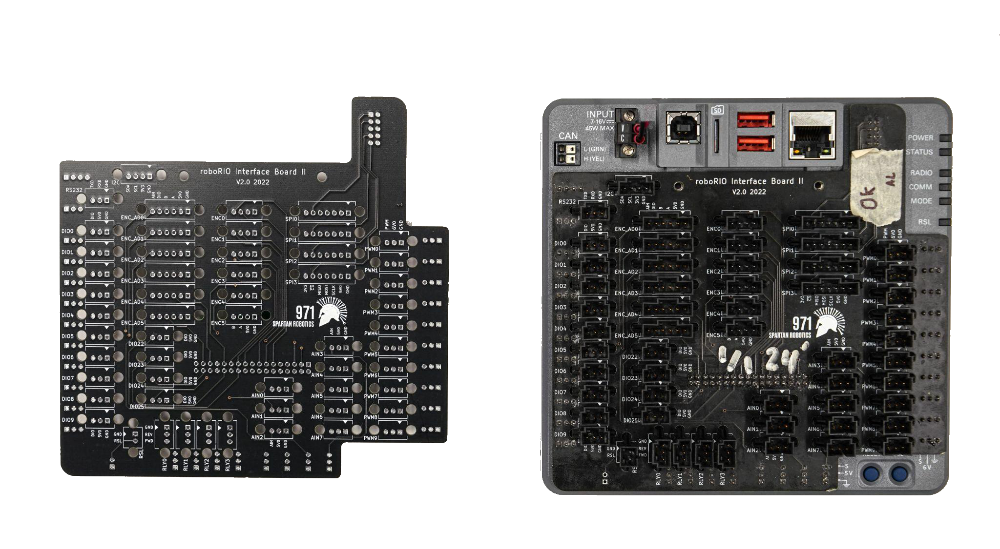
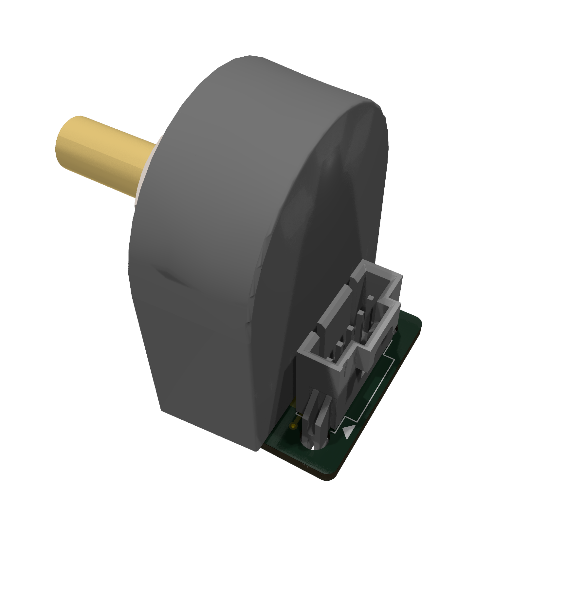
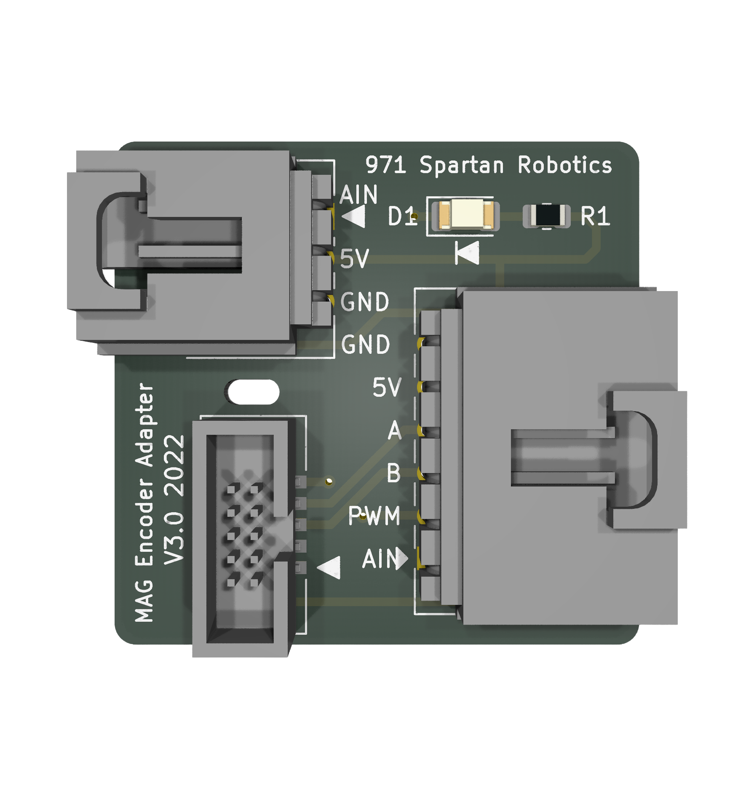
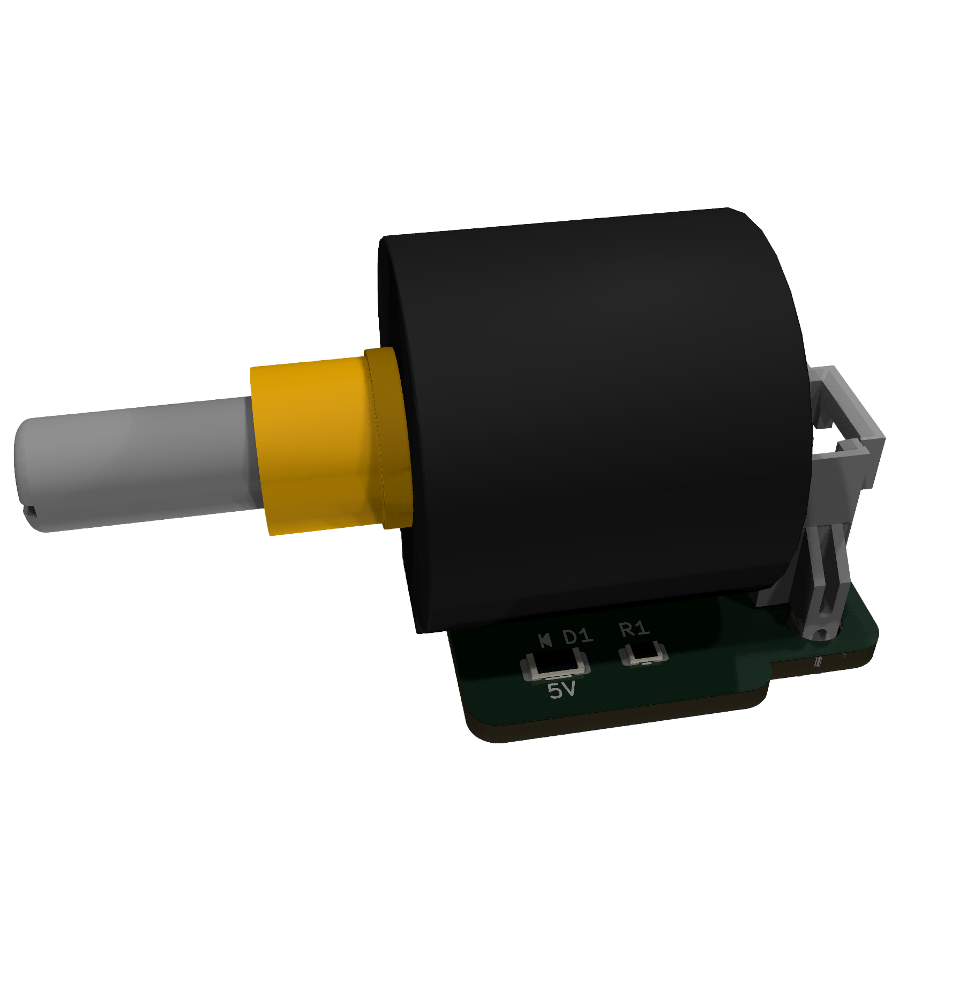
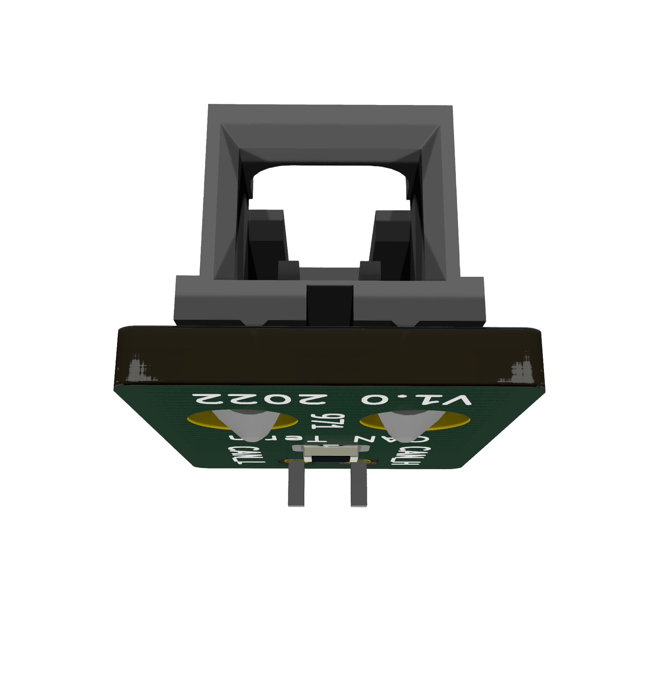
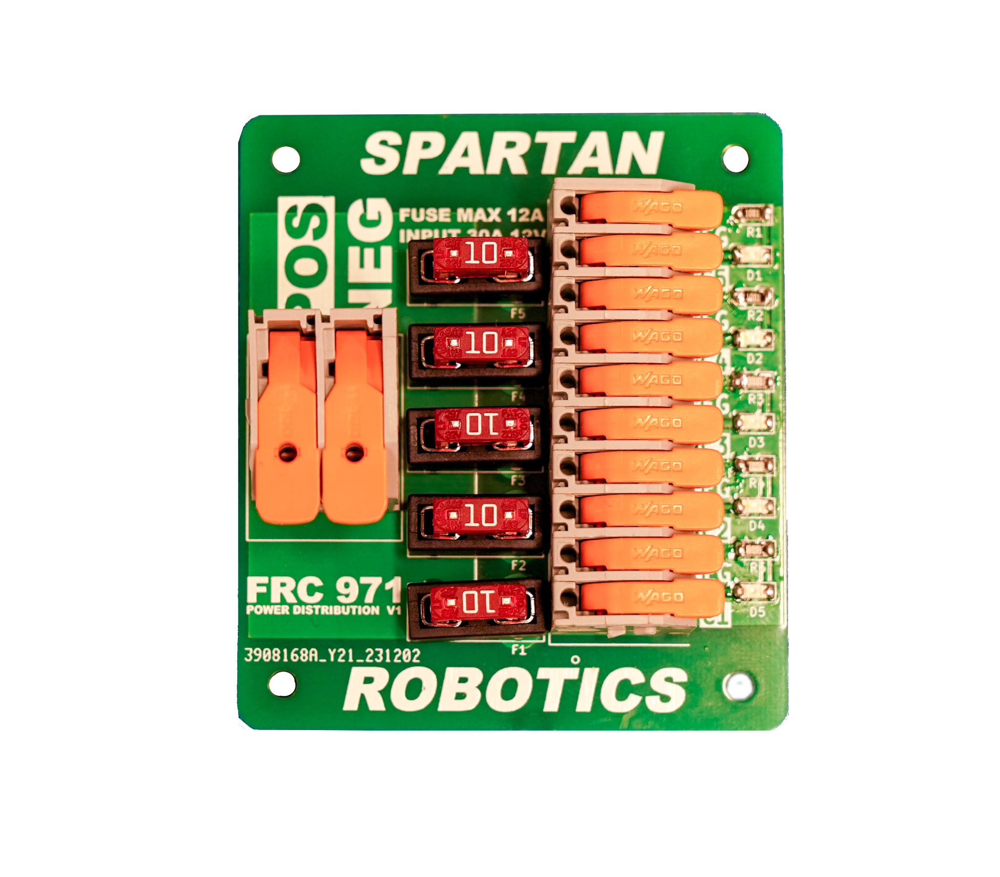
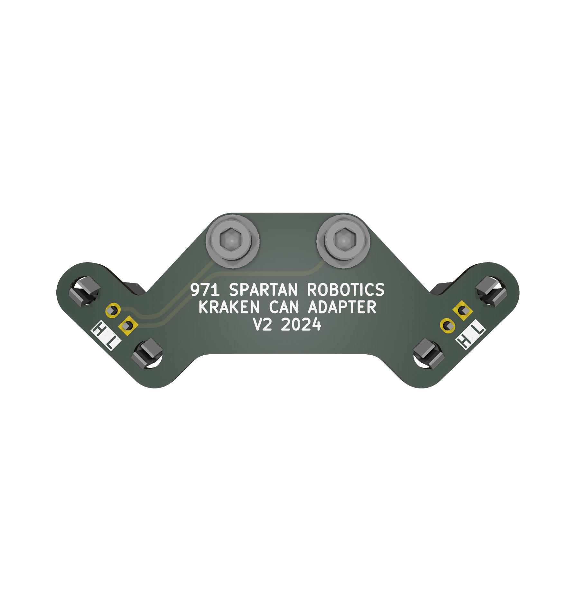

# PCB Catalog

Table Of Contents
1. [Beam Break Board](#beam-break-board)
    * [Features](#features-1)
    * [Specifications](#specifications)
    * [Applications](#applications)
        * [Compatibility](#compatibility)
2. [Spartan Board](#spartan-board)
    * [Features](#features-2)
3. [Encoder Adapter Board](#encoder-adapter-board)
    * [Features](#features-3)
4. [Mag Encoder Adapter Board](#mag-encoder-adapter-board)
    * [Features](#features-4)
5. [Potentiometer Adapter Board](#potentiometer-adapter-board)
    * [Features](#features-5)
6. [Can Terminator](#can-terminator)
    * [Features](#features-6)
7. [Mini Power Distribution Board](#mini-power-distribution-board)
    * [Features](#features-7)
    * [Specifications](#specifications-2)
        * [Rated Current](#rated-current)
8. [Kraken CAN Connector Board](#kraken-can-connector-board)
    * [Features](#features-8)
9. [Closing Notes](#closing-notes)
    * [Resources](#resources)

---

## Beam Break Board

### Features
* Interfaces industrial beam break sensors to the RoboRio
* Utilizes optocoupler to increase signal integrity by preventing ground loops
* Power and Signal LEDs to aid in user diagnostics
* Single-sided design for easy mounting and fabrication

### Specifications
* Active Low Output
* 12V Power
* Molex SL Connectors

### Applications
* Beam Break
* Other sensors with similar active low (NPN) output signal

#### Compatibility
* Sensors or switching devices with similar Output to Automation Direct QMI7-0N-0F
* Compatible with Spartan Board

---

## Spartan Board

### Features
* Converts all RoboRio connections to latching Molex SL connectors
* Quick and straightforward installation
* Labeled Ports
* All through-hole connectors for easy re-work/replacement and reliability
* 13x Digital I/O ports
* 8x Analog Input ports
* 6x Quadrature Encoder Input Ports
* 6x Combined Encoder, Analog Input, PWM Input Ports
* 10x PWM Outputs
* 4x SPI Ports
* I2C Bus
* RS232 Console
* RSL Port

---

## Encoder Adapter Board

### Features
* Connects 5-pin optical encoder (US Digital [S1-512-250-IE-B-D](https://www.usdigital.com/products/encoders/incremental/shaft/s1/)) to a Molex SL connector 
* Power indication LED 
* Compatible with Spartan Board

---

## Mag Encoder Adapter Board

### Features
* Connects 3-pin [3549S-1BA-102B potentiometer](https://www.digikey.com/en/products/detail/bourns-inc/3549S-1BA-102B/2534314) and 10-pin [CTRE mag encoder](https://store.ctr-electronics.com/srx-mag-encoder/) to a 6-pin Molex SL connector
* Compatible with Spartan Board
* Power indication LED 

---

## Potentiometer Adapter Board

### Features
* Connects 3-pin [3549S-1BA-102B potentiometer](https://www.digikey.com/en/products/detail/bourns-inc/3549S-1BA-102B/2534314) 3 to 10 turn potentiometers to a Molex SL connector 
* Power indication LED 
* Compatible with Spartan Board

---

## Can Terminator

### Features
* 120 Ohm CAN bus terminator using a Molex SL connector

---

## Mini Power Distribution Board

### Features
* LED lights up when a fuse is inserted. 
* Replaceable fuses
* Labeled connectors   

### Specifications
* 12-24 AWG output WAGO connectors
* 8-24AWG input WAGO connectors
* [MINI® 297 fuses](https://www.littelfuse.com/products/fuses/automotive-passenger-car/blade-fuses/297.aspx)

	#### Rated Current
	* Max current is 10 amps per circuit

---

## Kraken CAN Connector Board

### Features
* Molex SL connectors
* Simplifies connecting Kraken motors to a CAN bus

